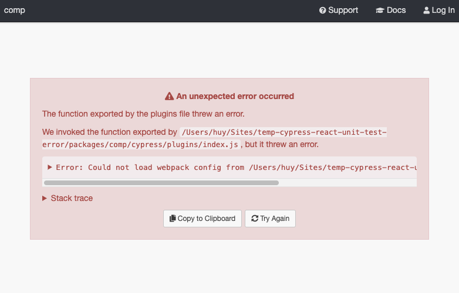

Error repro steps:

- `yarn install`.
- `yarn workspace comp cypressOpen`.
- Get error:

```text
  cypress-react-unit-test got webpack config filename webpack.config.js +0ms
  cypress-react-unit-test resolved webpack at /Users/huy/Sites/temp-cypress-react-unit-test-error/packages/comp/webpack.config.js +1ms
  find-webpack trying to load webpack config from /Users/huy/Sites/temp-cypress-react-unit-test-error/packages/comp/webpack.config.js +0ms
  find-webpack calling webpack function with environment "development" +6ms
  find-webpack could not load react-scripts webpack +0ms
  find-webpack error path is not defined +0ms
  find-webpack ReferenceError: path is not defined
  find-webpack     at module.exports (/Users/huy/Sites/temp-cypress-react-unit-test-error/packages/comp/webpack.config.js:8:15)
  find-webpack     at Object.tryLoadingWebpackConfig (/Users/huy/Sites/temp-cypress-react-unit-test-error/.yarn/cache/find-webpack-npm-1.14.0-3febfdf1f3-048faf024c.zip/node_modules/find-webpack/src/load-webpack-config.js:31:24)
  find-webpack     at module.exports (/Users/huy/Sites/temp-cypress-react-unit-test-error/.yarn/$$virtual/cypress-react-unit-test-virtual-3e880bff95/0/cache/cypress-react-unit-test-npm-4.7.0-b405f44a25-ee3db372fe.zip/node_modules/cypress-react-unit-test/plugins/load-webpack/index.js:21:38)
  find-webpack     at module.exports (/Users/huy/Sites/temp-cypress-react-unit-test-error/packages/comp/cypress/plugins/index.js:23:58)
  find-webpack     at /Users/huy/Library/Caches/Cypress/4.8.0/Cypress.app/Contents/Resources/app/packages/server/lib/plugins/child/run_plugins.js:78:12
  find-webpack     at tryCatcher (/Users/huy/Library/Caches/Cypress/4.8.0/Cypress.app/Contents/Resources/app/packages/server/node_modules/bluebird/js/release/util.js:16:23)
  find-webpack     at Function.Promise.attempt.Promise.try (/Users/huy/Library/Caches/Cypress/4.8.0/Cypress.app/Contents/Resources/app/packages/server/node_modules/bluebird/js/release/method.js:39:29)
  find-webpack     at load (/Users/huy/Library/Caches/Cypress/4.8.0/Cypress.app/Contents/Resources/app/packages/server/lib/plugins/child/run_plugins.js:75:7)
  find-webpack     at EventEmitter.<anonymous> (/Users/huy/Library/Caches/Cypress/4.8.0/Cypress.app/Contents/Resources/app/packages/server/lib/plugins/child/run_plugins.js:231:5)
  find-webpack     at EventEmitter.emit (events.js:210:5)
  find-webpack     at process.<anonymous> (/Users/huy/Library/Caches/Cypress/4.8.0/Cypress.app/Contents/Resources/app/packages/server/lib/plugins/util.js:19:22)
  find-webpack     at process.emit (events.js:210:5)
  find-webpack     at emit (internal/child_process.js:876:12)
  find-webpack     at processTicksAndRejections (internal/process/task_queues.js:81:21) +0ms
```

```
**Message:** The function exported by the plugins file threw an error.

We invoked the function exported by `/Users/huy/Sites/temp-cypress-react-unit-test-error/packages/comp/cypress/plugins/index.js`, but it threw an error.

**Details:** Error: Could not load webpack config from /Users/huy/Sites/temp-cypress-react-unit-test-error/packages/comp/webpack.config.js
    at module.exports (/Users/huy/Sites/temp-cypress-react-unit-test-error/.yarn/$$virtual/cypress-react-unit-test-virtual-3e880bff95/0/cache/cypress-react-unit-test-npm-4.7.0-b405f44a25-ee3db372fe.zip/node_modules/cypress-react-unit-test/plugins/load-webpack/index.js:23:11)
    at module.exports (/Users/huy/Sites/temp-cypress-react-unit-test-error/packages/comp/cypress/plugins/index.js:23:58)
    at /Users/huy/Library/Caches/Cypress/4.8.0/Cypress.app/Contents/Resources/app/packages/server/lib/plugins/child/run_plugins.js:78:12
    at tryCatcher (/Users/huy/Library/Caches/Cypress/4.8.0/Cypress.app/Contents/Resources/app/packages/server/node_modules/bluebird/js/release/util.js:16:23)
    at Function.Promise.attempt.Promise.try (/Users/huy/Library/Caches/Cypress/4.8.0/Cypress.app/Contents/Resources/app/packages/server/node_modules/bluebird/js/release/method.js:39:29)
    at load (/Users/huy/Library/Caches/Cypress/4.8.0/Cypress.app/Contents/Resources/app/packages/server/lib/plugins/child/run_plugins.js:75:7)
    at EventEmitter.<anonymous> (/Users/huy/Library/Caches/Cypress/4.8.0/Cypress.app/Contents/Resources/app/packages/server/lib/plugins/child/run_plugins.js:231:5)
    at EventEmitter.emit (events.js:210:5)
    at process.<anonymous> (/Users/huy/Library/Caches/Cypress/4.8.0/Cypress.app/Contents/Resources/app/packages/server/lib/plugins/util.js:19:22)
    at process.emit (events.js:210:5)
    at emit (internal/child_process.js:876:12)
    at processTicksAndRejections (internal/process/task_queues.js:81:21)

**Stack trace:**
Error: The function exported by the plugins file threw an error.

We invoked the function exported by `/Users/huy/Sites/temp-cypress-react-unit-test-error/packages/comp/cypress/plugins/index.js`, but it threw an error.
    at Object.get (/Users/huy/Library/Caches/Cypress/4.8.0/Cypress.app/Contents/Resources/app/packages/server/lib/errors.js:1035:15)
    at EventEmitter.<anonymous> (/Users/huy/Library/Caches/Cypress/4.8.0/Cypress.app/Contents/Resources/app/packages/server/lib/plugins/index.js:121:21)
    at EventEmitter.emit (events.js:210:5)
    at ChildProcess.<anonymous> (/Users/huy/Library/Caches/Cypress/4.8.0/Cypress.app/Contents/Resources/app/packages/server/lib/plugins/util.js:19:22)
    at ChildProcess.emit (events.js:210:5)
    at emit (internal/child_process.js:876:12)
    at processTicksAndRejections (internal/process/task_queues.js:81:21)

```


